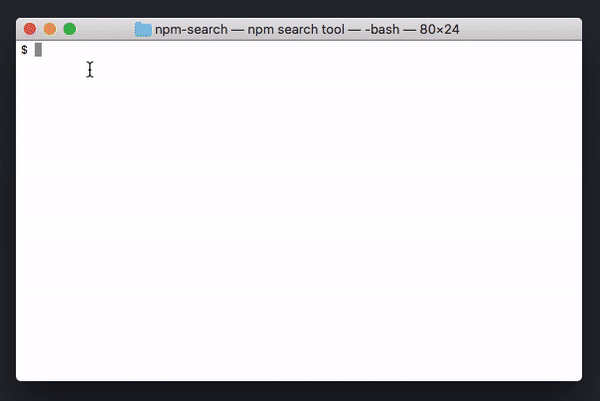

# npm-search

A very simple npm search play thingy, using [libnpmsearch](https://npm.im/libnpmsearch) and [blessed](https://npm.im/blessed).

```
npm i -g isiahmeadows/npm-search
```

Quick ~40-second GIF demo:



You can scroll with either the mouse wheel or arrow keys. You can also view the name + description in a larger view by clicking on the search result.

## License

ISC License
